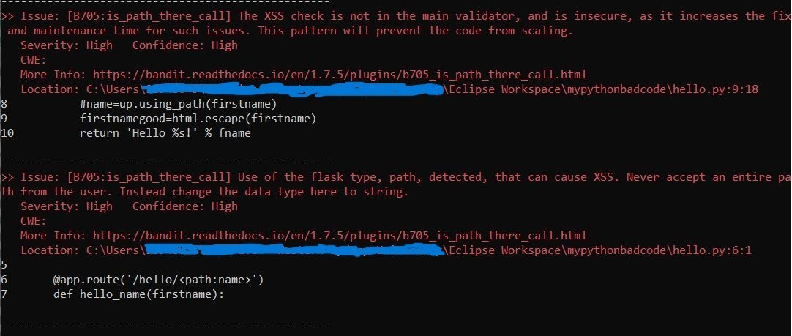
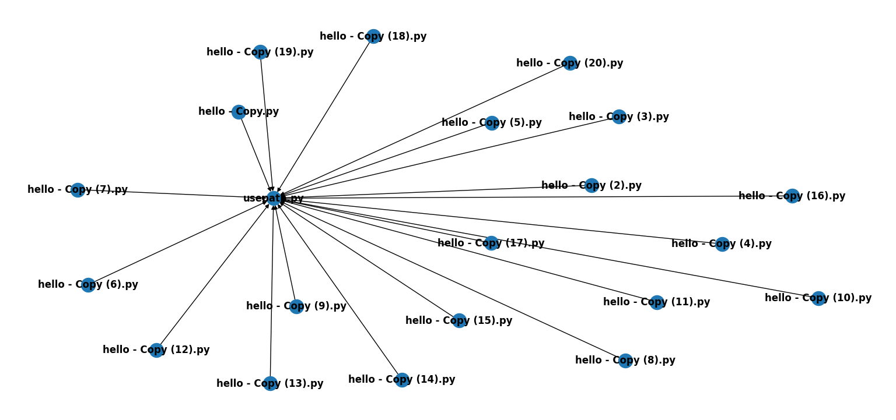

# Test bad code in Python

## Name
mypythonbadcode_game_theory_experiment

## Description
This project has intentionally bad code, written in Python, to test our actual implementation in https://github.com/earthling1984/bandit_rule_game_theory_experiment, where the aim of the Ph.D. is to have the work sit in a compiler like application like bandit, to apply Game Theory to existing code blocks, figure out incompatible maths that is going to impact co-operation, re-design the game to foster co-operation, modify the source, and check it in into a separate branch. This branch is hoped to be seen as a candidate to be merged into the master branch.

## Pre-requisites
- Install bandit from https://github.com/PyCQA/bandit/tree/main
- Install our bandit plugin from https://github.com/earthling1984/bandit_rule_game_theory_experiment

## Example usage
Once you download this sample code, and once you have the above pre-requisites sorted, you would run the following command:

bandit -r -t B705 -x "C:\Users\<Your-Location>\Eclipse Workspace\mypythonbadcode\__pycache__","C:\Users\<Your-Location>\Eclipse Workspace\mypythonbadcode\venv" "C:\Users\<Your-Location>\Eclipse Workspace\mypythonbadcode"

You can ignore pycache and venv ignore options above, if directly using these test files and not creating your own test files. In that case, you can give your target directory, with some tweaks that may be necessary in the main bandit plugin. Reach out to us please if you need those tweaks. The above command run bandit on this test code base, with our plugin (numbered 705), excluding certain unnecessary files. The output is expected to be a new branch, with the secure code, given the logic in our bandit plugin.

A sample output, with the plugin's findings, is below:

One test case checked was if the defensive code is in an unexpected class, or not in the file marked for the defensive code. In such case, if the defensive code is used in many places one by one, the below graph explains the ensuing cacophony. The vision is to have such common code written into the common file, instead of individual files, from where it will be deleted. A graph like this would be the input to the game we will analyze. The idea is that such a graph risks co-operation breakdown, if the dev has to add the defensive code in all their locations. The solution offered will be a common file, maintained by a security champion/engineer, and the devs simply call the common file for sanitization, instead of having it everywhere.

## License
Apache
